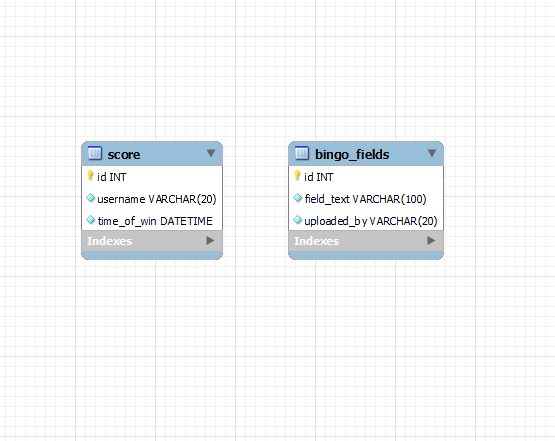

# Rendszerterv
## 1. A rendszer célja

Az alkalmazás célja egy Bingó játék szimulálására képes alkalmazás létrehozása. A felhasználó képes több bingó lapot generálni, azokon játszani. A bingó lapok tartalma egy közponi adatbázisból generálódik, véletlen formában. Az adatábázisban tároljuk az egyes felhasználók által elért eredményeket is.

## 2. Projektterv

## 3. Folyamatok modellje

## 4. Követelmények

### Funkcionális követelmények

- Bingó lapok generálása
- A lapokon való játék lehetősége
- Eredmények mentése

### Nemfunkcionális követelmények

- Java nyelv használata fejlesztéshez
- Az alkalmazás adatbázishoz kapcsolódik
- Tervezési minták használata

### 5. Fejlesztő eszközök

A fejlesztés során használt eszközök:
- Visul Studio Code
- IntelliJ Idea Ultimate
- Xampp
- Mysql

## 6. Architekturális terv

### Adatbázis rendszer

A programhoz MySQL adatábzist szervert használunk.

### A program elérése, kezelése

A program a legtöbb asztali operációs rendszeren elfut, tekintettel arra, hogy Java nyelven íródott, aminek sok operációs rendszeren van futtató környezete. E mellett szükséges még internet hozzáférés is a megfelelő működéshez (vagy kapcsolat az adatbázis szerverhez).

## 7. Adatbázis terv

## 8. Implementációs terv

## 9. Tesztterv

A program tesztelése elsősorban unit tesztek segítségével történik, a manuális tesztelést leszámítva.

## 10. Telepítési terv

Fizikai telepítési terv: 

Szoftver telepítési terv: 

## 11. Karbantartási terv

Fontos ellenőrizni:
...

Figyelembe kell venni a felhasználó által jött visszajelzést is a programmal kapcsolatban.
Ha hibát talált, mielőbb orvosolni kell, lehet az:
*	Működéssel kapcsolatos
*	Kinézet, dizájnnal kapcsolatos