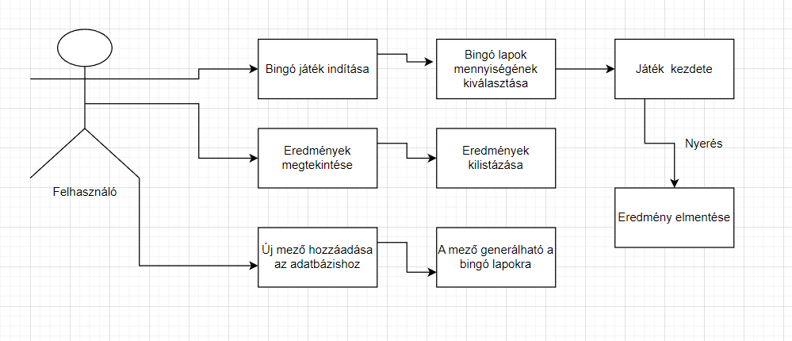

# Rendszerterv
## 1. A rendszer célja

Az alkalmazás célja egy Bingó játék szimulálására képes alkalmazás létrehozása. A felhasználó képes több bingó lapot generálni, azokon játszani. A bingó lapok tartalma egy közponi adatbázisból generálódik, véletlen formában. Az adatábázisban tároljuk az egyes felhasználók által elért eredményeket is.

## 2. Projektterv

A projekt elkészítése során a Java nyelvet használjuk. A feladat kiemelt pontja a tervezési minták használata. Ezért az adatábázis-al való kapcsolat során Command tervezési mintát fogunk használni, a legenerált bingo lapok közötti kapcsolattartáshoz.

## 3. Folyamatok modellje

## 4. Követelmények

### Funkcionális követelmények

- Bingó lapok generálása
- A lapokon való játék lehetősége
- Eredmények mentése

### Nemfunkcionális követelmények

- Java nyelv használata fejlesztéshez
- Az alkalmazás adatbázishoz kapcsolódik
- Tervezési minták használata

### 5. Fejlesztő eszközök

A fejlesztés során használt eszközök:
- Visul Studio Code
- IntelliJ Idea Ultimate
- Xampp
- Mysql

## 6. Architekturális terv

### Adatbázis rendszer

A programhoz MySQL adatábzist szervert használunk.

### A program elérése, kezelése

A program a legtöbb asztali operációs rendszeren elfut, tekintettel arra, hogy Java nyelven íródott, aminek sok operációs rendszeren van futtató környezete. E mellett szükséges még internet hozzáférés is a megfelelő működéshez (vagy kapcsolat az adatbázis szerverhez).

## 7. Adatbázis terv

## 8. Implementációs terv
Az alkalmazást a Java nyelv segítségével tervezzük megvalósítani. A fejlesztés során MySQL adatbázist használunk. Az implementálás során nagy figyelmet kap az OCP és SRP szabályainak betartása.
Kettő "nagyobb" tervevzési mintát tervezünk implementálni:
 - Observer: több bingó lap egyidejű futása esetén a többi lap értesítése, ha valamelyik nyer.
 - Command: adatábázis kapcsolat használata során.

## 9. Tesztterv

A program tesztelése elsősorban unit tesztek segítségével történik - a manuális tesztelése kívül -, JUnit segítségével.

## 10. Telepítési terv

Az alkalmazás önmagában nem igényel telepítést, viszont szükséges hozzá valamilyen Java futtatókörnyezet telepítése, ennek a telepítésének a menete az operációs rendszertől függ, ez megtalálható a Java dokumentécióban.

## 11. Karbantartási terv

- A projekt átadása után jelzett hibák javítása igényszerűen.
- 6 havonta Java futtatókörnyezet frissítése és egyes komponensek frissítése ezzel együtt.